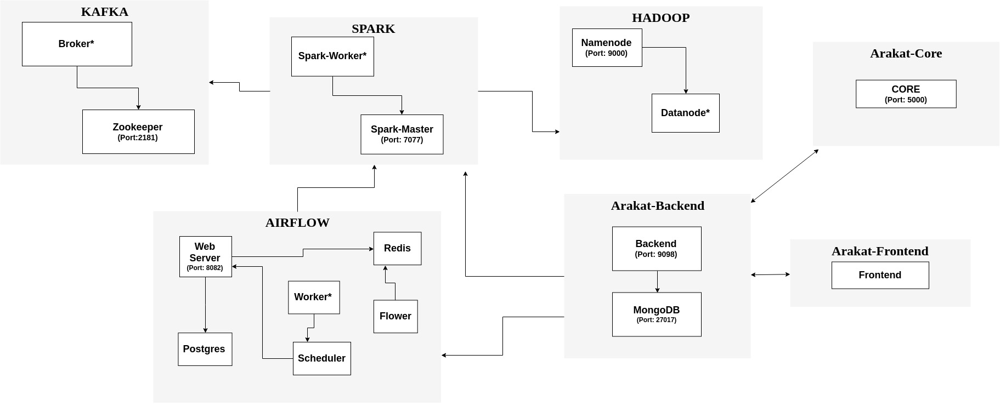

## Arakat Küme(Cluster) Konfigürasyonu

Yukarıda belirtilen şekilde, Arakat projesinin çalışacağı küme görselleştirilmiştir.  Bu küme Arakat-Core, Arakat-Backend, Arakat-Fronted, Apache Spark, Apache Hadoop, Apache Kafka ve Apache Airflow olmak üzere yedi farklı bileşenden oluşmaktadır. Bu yapının bileşenleri “Docker Hub” içerisinde bulunmaktadır. Bu imajlar ile ilgili bilgiler aşağıdaki gibidir:

1. Arakat Core – arakat/arakat-core (https://hub.docker.com/r/arakat/arakat-core/)  
2. Arakat Backend – arakat/arakat-backend
(https://hub.docker.com/r/arakat/arakat-backend/ )  
MongoDB – mongo (https://hub.docker.com/_/mongo/)
3. Arakat Frontend – arakat/arakat-frontend
4. Apache Spark – master node:
 bde2020/spark-master(https://hub.docker.com/r/bde2020/spark-master) 
Apache Spark – worker node: bde2020/spark-worker(https://hub.docker.com/r/bde2020/spark-worker) 
5. Apache Hadoop – namenode: bde2020/hadoop-namenode (https://hub.docker.com/r/bde2020/hadoop-namenode/ ) 
Apache Hadoop – datanode: bde2020/hadoop-datanode (https://hub.docker.com/r/bde2020/hadoop-datanode/ ) 
6. Apache Kafka – zookeeper: wurstmeister/zookeeper (https://hub.docker.com/r/wurstmeister/zookeeper/ ) 
Apache Kafka – broker: wurstmeister/kafka (https://hub.docker.com/r/wurstmeister/kafka/ ) 
7. Apache Airflow – arakat/arakat-airflow (https://hub.docker.com/r/arakat/arakat-airflow/)  
Postgres: postgres:9.6 (https://hub.docker.com/_/postgres/)  
   Redis: redis:3.2.7 (https://hub.docker.com/_/redis/)

Bu imajlar kullanılarak Docker Swarm yardımı ile bir küme oluşturabilmek için “docker compose” dosyaları hazırlanmıştır. 

Kullanılan yedi bileşen içerisinde bulunan bazı konteynerler ölçeklenebilirliği sağlamak için küme içerisinde bulunan bilgisayar sayısına paralel olarak artmaktadır (şekil içerisinde ‘...’ ile gösterilmiştir). Bu konteynerler şunlardır:

   1. Spark modülü altında bulunan Worker
   2. Kafka modülü altında bulunan Broker
   3. Hadoop modülü altında bulunan Datanode
   4. Airflow modülü altında bulunan Air-Worker

Bu yapının test edildiği bilgisayarlarda aşağıda belirtilen, docker ve docker-compose sürümleri kullanılmıştır:

    Docker sürümü: 18.06.1-ce 
    Docker Compose sürümü: 1.17.1

Bu altyapının ayağa kaldırılması için startAll.sh'ın çalıştırılması yeterlidir. 

	sh startAll.sh

Bu betik docker swarm’ın oluşturulmasını, konteynerlerin ihtiyaç duyacağı gerekli ağın oluşturulmasını ve konteynerleri oluşturmak için hazırlanan betiklerin çalıştırılmasını sağlamaktadır.  Aşağıda belirtilen konteynerler oluşturulur:

    1. arakat-core
    2. arakat-backend
    3. mongodb
    4. arakat-frontend
    5. hadoop-namenode
    6. hadoop-datanode
    7. spark-master
    8. spark-worker
    9. kafka-zookeeper
    10. kafka-broker
    11. airflow-flower
    12. airflow-postgres
    13. airflow-redis
    14. airflow-air-worker
    15. airflow-scheduler
    16. airflow-web server

Oluşturulan konteynerler ve lokal bilgisayar arasında ortak kullanılacak klasörler küme konfigürasyonunda belirlenmiştir. Lokal makinenizde klasör yolları aşağıdaki gibidir: 

Oluşturulan konteynerler ve lokal bilgisayar arasında ortak kullanılacak klasörler “docker compose” dosyaları içierisinde belirlenmiştir. Lokal makinenizde klasör yolları aşağıdaki gibidir: 

    • Arakat Cluster Configuration/scripts/spark_code 
    • Arakat Cluster Configuration/scripts/airflow_dags
    • Arakat Cluster Configuration/airflow_logs

Bu klasörler Spark için oluşturulan kodların Spark konteynerleri ve lokal bilgisayar arasında paylaşılmasını sağlarken, aynı zamanda Airflow için hazırlanan DAG dosyalarını airflow-worker, airflow-webserver, airflow-scheduler ve lokal makineniz arasında paylaşmasını da sağlar. Dolayısıyla ortak kullanılan bu klasörlerden herhangi biri üzerinde yapılacak değişiklik klasörleri ortak kullanan bütün paydaşlarını etkiler.