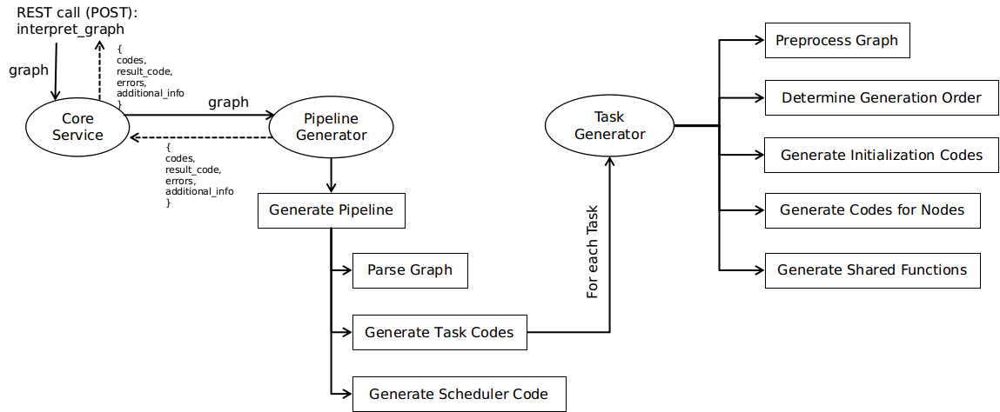

## Temel Akış

Arakat-Core Temel Akış Şablonu

Arakat-Core modülünün kod üretim akışı backend tarafından gönderilen REST call'u (*interpret_graph*) ile başlar. Bu *POST* call'u *json* formatında bir *graph* gönderir ve cevap olarak üretilen kodları, başarılı yürütülmeyi gösteren *result_code*'u, error bilgisini ve ek bilgileri cevap olarak kabul eder. Ek bilgiler, kod üretimi sırasında tutulması gerekli görülen bilgilerdir. Mevcut versiyonda, kod üretimi sırasında yazma işlemi yapan nodlar olduğu durumda, verinin hangi veri kaynağına yazıldığı, bu veri kaynağına erişim için gerekli bilgiler (ip, port vb.), varsa verinin hangi *path*'e kaydedildiği gibi bilgiler tutulmaktadır.

*PipelineGenerator*, *CoreService* üzerinden alınan *graph*'ı önce *parse* eder. Bu işlem, graph içerisinde yer alan *task*'ların içerdikleri nod ve bağlantılar ile birlikte birbirinden ayrılmasını amaçlar. Bu sayede, her bir task birbirinden bağımsız olarak işlenebilecek ve bunlara tekabül edecek kodlar/betikler birbirinden bağımsız olarak oluşturulabilecektir. **Burada not edilecek önemli bir husus da task'lar arasında sadece takvimlemeyi belirleyen bağlantıların var olduğudur. Bir başka deyişle, farklı task'ları oluşturan nodlar arasında bir bağlantı bulunamaz.**

Birbirinden ayrılan task'ların her biri için *TaskGenerator* kullanılarak bu task'ı gerçekleyen kodlar/betik oluşturulur.

Task'lar yaratıldıktan sonra, takvimleme için gerekli betik *ScheduleGenerator* kullanılarak oluşturulur. Bu doğrultuda, task'lar arasında sırayı belirten bağlantılar takvimi oluşturmak için kullanılır. Buna ek olarak, graph'la beraber gönderilen takvimleme için gerekli bilgi de kullanılmaktadır. Bu bilgiler; sözkonusu takvimin *id*'si, tekrarlanma stratejisi, başlama-bitiş zamanı, takvimin sahibi vb. verilerden oluşmaktadır.

*TaskGenerator* task'a ait graph'ı önişleyerek akışına başlar. Bu ön işleme ile bağlantılar incelenerek nodların hangi nodlar gerçeklendikten sonra gerçeklenebileceği ve sözkonusu nodların gerçeklenmesinin hangi nodların gerçeklenmesini mümkün kılacağı saptanır. Bu bilgiler, task'taki nodların sıraya konabilmesi için gereklidir.

*TaskGenerator* bir sonraki adımda, nodları sıraya koyar. Bu sıra, bir nod için üretilen kodda, bir başka nod için üretilen kodun parçaları referans olarak kullanmak istediğinde önem arz etmektedir. Örneğin, bir nodun ürettiği makine öğrenmesi modelini kullanmak isteyen bir nod, bu modeli yaratan noddan sonra gelmelidir. Bu şekilde, modeli üreten kod betik içerisinde daha önce yer alacak ve bunu kullanmak isteyen nodlara ait kodlar da daha önce üretilmiş bu modelin referansını kullanabileceklerdir.

Bir sonraki aşama, giriş (initialization) kodlarının hazırlanmasıdır. Bu kodlar, temel kütüphanelerin içerilmesi ve gerekli temel *context*'lerin yaratılması gibi işlevleri yerine getirir. Örneğin, Task bir Spark Task'ı ise gerekli Spark *context*'i ve *session*'ı bu aşamada yaratılmalıdır.

Giriş kısmından sonra, belirlenen sıraya göre nodlara ait kodlar üretilir. Her nod bünyesinde yer aldığı nod ailesi tarafından ele alınır.

Nodlara ait kodlar üretilirken ortak kullanılabilecek kod parçaları (genellikle *util* olarak işlev sağlayan fonksiyonlar) her nod için yaratılmaz. Paylaşılan kod parçalarını (fonksiyonlara vb.) tutan bir global set tutulmaktadır. Bu şekilde, gereksiz kod üretiminden kaçınılmaktadır.